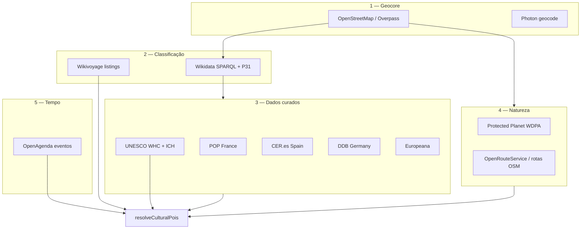

# Arquitetura de dados culturais e atividades (global)

Estratégia de ingestão para museus, monumentos, atividades ao ar livre e eventos — além de OSM/Wikidata generalistas.

## Estado actual no beta-app

| Camada | Já existe | Ficheiros |
|--------|-----------|-----------|
| Geometria / POIs base | OSM (Photon, BizData), mapa Leaflet | `src/lib/travel/osm/`, `docs/OSM_HOTELS.md` |
| Enriquecimento semântico | Wikidata (imagens Commons) | `src/lib/travel/osm/wikidata.ts` |
| Guias locais | Wikivoyage (listings `see`/`do`/`sleep`) | bundle + DB `wv_listings` |
| Património UNESCO | WHC + ICH offline | `data/unesco/`, `unesco-heritage-index.ts` |
| Natureza / clima | Open-Meteo, GeoNames | `destination-enrichment.ts` |
| Resolver unificado | **Novo** | `src/lib/travel/cultural/resolve-cultural-pois.ts` |

## Pirâmide de prioridade (ingestão)



### 1. OpenStreetMap (geocore internacional)

Homogéneo globalmente. Tags prioritárias para Overpass:

| Tag | Uso |
|-----|-----|
| `tourism=museum`, `gallery`, `aquarium`, `zoo`, `theme_park`, `viewpoint`, `artwork` | Cultura fixa |
| `leisure=*` | `fitness_centre`, `sports_centre`, `water_park`, `escape_game`, `horse_riding` |
| `shop=rental` + `rental=bicycle` / `ski` | Equipamento |
| `route=hiking` / `route=bicycle` | Trilhos |
| `historic=*`, `heritage=*` | Monumentos |

Implementação: `src/lib/travel/cultural/overpass-activities.ts` (queries reutilizáveis).

Endpoint futuro: `GET /api/travel/v1/culture/osm?lat=&lon=&radiusKm=`

### 2. Wikidata (listas temáticas massivas)

Ligar `osm_id` → `wikidata` → propriedades (P571 fundação, P84 arquitecto, P1435 património).

Queries SPARQL úteis (offline batch → JSON shard):

- `P31` = museum (`Q33506`), archaeological site (`Q839954`), water park (`Q1141521`)
- `P1435` = UNESCO World Heritage (`Q9259`)
- Coordenadas `P625`

Script futuro: `scripts/fetch-wikidata-cultural.mjs` (mesmo padrão que `fetch-wikidata-hotels.mjs`).

### 3. Agregadores nacionais (sobrescrever / validar OSM+WD)

| País | Fonte | Escala | API / dados | Prioridade PT+IB |
|------|-------|--------|-------------|------------------|
| 🇫🇷 França | [POP](https://pop.culture.gouv.fr/) | ~3,2M registos | REST `museums-of-france`, CC0 | Alta (turismo FR) |
| 🇪🇸 Espanha | [CER.es](https://cer.es/) | Museus estatais + CCAA | Linked data datos.gob.es | Alta |
| 🇩🇪 Alemanha | [DDB](https://www.deutsche-digitale-bibliothek.de/) | Entidades Kultur | API Kultur erbt | Média |
| 🇳🇱 NL | RCE Rijksmonumenten + Museumregister | Monumentos + museus | Open data CSV | Média |
| 🇬🇧 UK | [Art UK](https://artuk.org/) | 3k+ coleções | API (registo) | Média |
| 🇪🇺 Pan-EU | [Europeana](https://www.europeana.eu/) | Metadados milhões | API REST gratuita | Validação instituição |

Env: `EUROPEANA_API_KEY` (registo gratuito).

Cliente inicial: `src/lib/travel/cultural/europeana.ts`.

POP endpoint exemplo: `https://api.pop.culture.gouv.fr/museums-of-france/` (sem chave).

### 4. Protected Planet (WDPA)

Fonte canónica UNEP-WCMC para parques nacionais, reservas, áreas marinhas.

- API: https://api.protectedplanet.net/ (token gratuito)
- Env: `PROTECTED_PLANET_TOKEN`
- Uso: polígonos + centroides → actividades natureza, filtros «parque nacional perto de X»

### 5. OpenAgenda (eventos efémeros)

Agendas municipais FR/EU — workshops, visitas guiadas, concertos.

- API: https://openagenda.com/
- Env: `OPENAGENDA_API_KEY`
- Uso: `?geo=lat,lon&radius=` + intervalo de datas no enrich do destino

## Modelo unificado (`CulturalPoi`)

```typescript
// src/lib/travel/cultural/types.ts
{
  id: string;           // "unesco:723", "osm:node/123", "pop:FR-..."
  kind: 'unesco_world' | 'unesco_ich' | 'museum' | 'monument' | 'activity' | 'nature' | 'event' | 'wikivoyage';
  source: 'unesco' | 'wikivoyage' | 'osm' | 'wikidata' | 'pop' | 'europeana' | 'cer' | 'ddb' | 'wdpa' | 'openagenda';
  title: string;
  lat?, lon?, distanceKm?, url?, category?;
  priority: number;   // menor = mais relevante no card
}
```

Resolver: `resolveCulturalPoisForDestination()` — já agrega UNESCO + Wikivoyage; slots para fontes nacionais por `paisCode`.

## Roadmap de implementação

| Fase | Entrega | Esforço |
|------|---------|---------|
| **A** ✅ | UNESCO no card + enrich + índice | Feito |
| **B** ✅ | `CulturalPoi` + resolver + doc | Feito |
| **C** ✅ | Overpass actividades (`tourism`/`leisure`) por destino | `overpass-activities.ts` + async resolver |
| **D** ✅ | POP FR + Wikidata ES (CER) offline → JSON shard | `travel:import:pop-france`, `wikidata-cultural-index` |
| **E** ✅ | Wikidata SPARQL batch (museus, sítios arqueológicos) | `travel:fetch:wikidata-cultural` |
| **F** ✅ | Protected Planet + filtro natureza | `travel:import:protected-planet`, `protected-planet.ts` |
| **G** ✅ | OpenAgenda eventos no enrich (datas viagem) | `openagenda.ts`, `?dateFrom=&dateTo=` no enrich |
| **H** ✅ | Europeana validação cruzada (instituição activa) | `europeana.ts` no async resolver |

## Scripts npm

```bash
npm run travel:build:unesco-index         # UNESCO WHC + ICH
npm run travel:import:pop-france          # museus POP (França)
npm run travel:fetch:wikidata-cultural    # museus / sítios Wikidata
npm run travel:import:protected-planet    # WDPA (token obrigatório)
npm run travel:import:cultural-all        # meta-script offline D–F
```

Enrich com eventos:

```
GET /api/travel/v1/destinations/{slug}/enrich?dateFrom=2026-06-01&dateTo=2026-06-14&live=false
```

## Integração UI

| Superfície | Campo |
|------------|-------|
| Card resultados | `result.unesco` + futuro `result.culturalHighlights` |
| Detalhe destino | `DestinationEnrichmentPanel` → `culturalPois` |
| Mapa | marcadores `kind: unesco` → expandir `museum`, `nature` |

## Referências

- [OSM tourism tags](https://wiki.openstreetmap.org/wiki/Key:tourism)
- [Wikidata SPARQL](https://query.wikidata.org/)
- [Europeana API](https://pro.europeana.eu/page/get-api)
- [Protected Planet API](https://api.protectedplanet.net/)
- [OpenAgenda API](https://developers.openagenda.com/)
